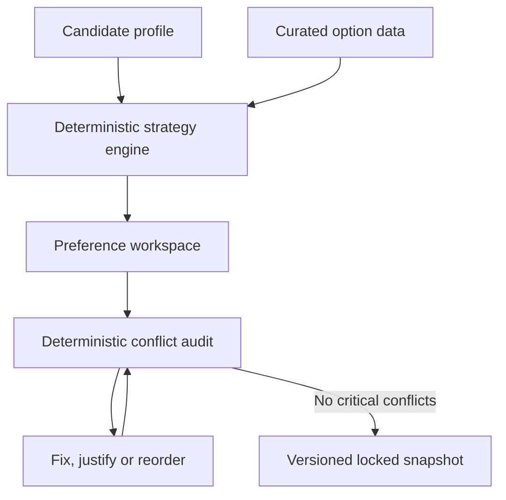

# CounselFlow architecture

## Product boundary

The MVP solves one problem well: build a personalized counselling preference order,
explain it, find conflicts, and safely lock a corrected list.



Optional AI sits behind an explanation adapter. It may summarize the engine's stored
facts; it cannot score options, invent evidence, alter ordering, or override the lock
gate. A template explanation is the mandatory fallback.

## Runtime boundaries

### Current integration app

The root React/Vite app is both the candidate UI and the local integration lab. Existing
code remains in `src/screens`, `src/state`, `src/mock`, `src/data` and `src/types` while
the team freezes contracts. This avoids a pre-demo rewrite.

New or extracted feature code should converge toward:

```text
src/features/<feature>/
├── components/        feature-owned UI
├── fixtures/          feature-level examples
├── lib/               pure feature logic
├── tests/             behavior tests
├── index.ts           public exports only
└── README.md          owner, scope and contract notes
```

No feature may import another feature's internal file. Import from its `index.ts` or
from a shared contract/package.

### Shared contracts

`packages/contracts` will own validated request/response schemas for:

- candidate profile and constraints;
- strategy items, reasons and confidence;
- conflict evidence and actions;
- audit results, overrides and re-audit version;
- locked snapshot and source metadata.

`src/types/index.ts` is the current provisional frontend contract. Move it only in a
dedicated contract PR after frontend and backend agree on field names, nullability,
versions and error shape.

### Backend service

Backend work belongs under `services/api`; never place server secrets or persistence
logic in `src`. The initial modules are `profile`, `strategy`, `audit`, `lock`, `data`
and `health`. The server validates every payload and remains authoritative.

## Data and decision rules

The curated dataset carries a source label, cycle/year and explicit missing facts.
Generated lists must never claim guaranteed admission or fabricated probabilities.
Every conflict needs a stable ID derived from its rule and involved items, so an
acknowledged warning does not reappear as a different conflict after re-audit.

Locking is permitted only when:

1. the audit matches the latest list/profile revision;
2. no critical conflict remains;
3. every kept warning has a written reason;
4. the snapshot records profile, dataset and engine versions plus final order.

## Deliberate hackathon exclusions

- automated scraping or ingestion pipelines;
- admin console, payments, submission or real counselling transactions;
- broad multi-counselling/multi-cycle coverage;
- Redis/workers/notifications unless a judge-required flow proves the need;
- opaque LLM ranking, guarantee language or fake admission probability;
- chatbot features unrelated to the preference strategy flow.
